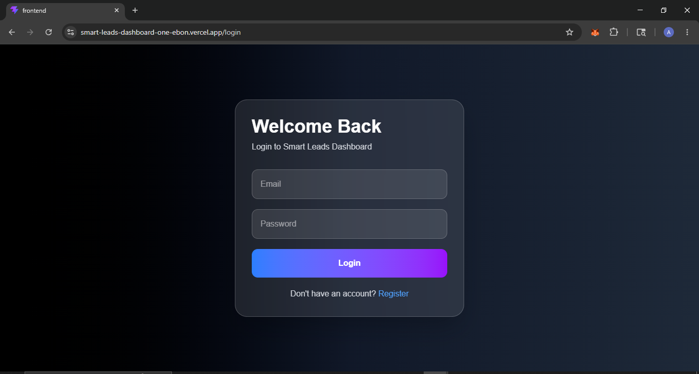
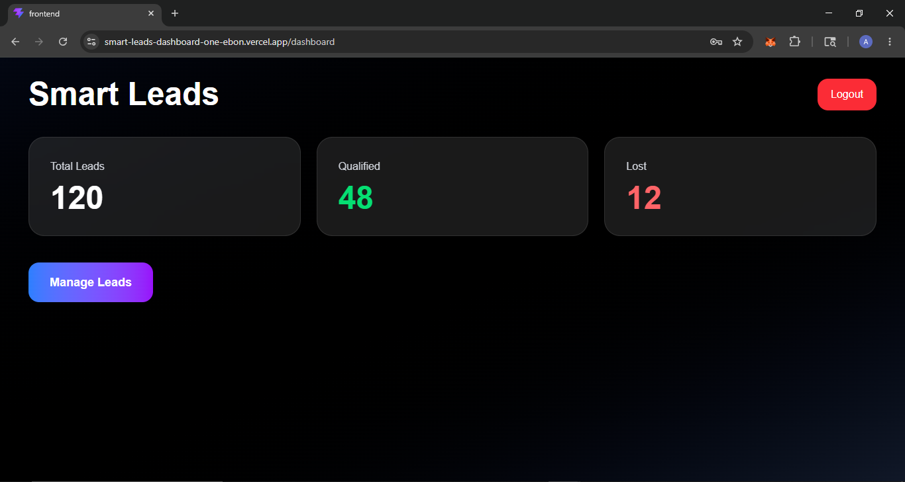
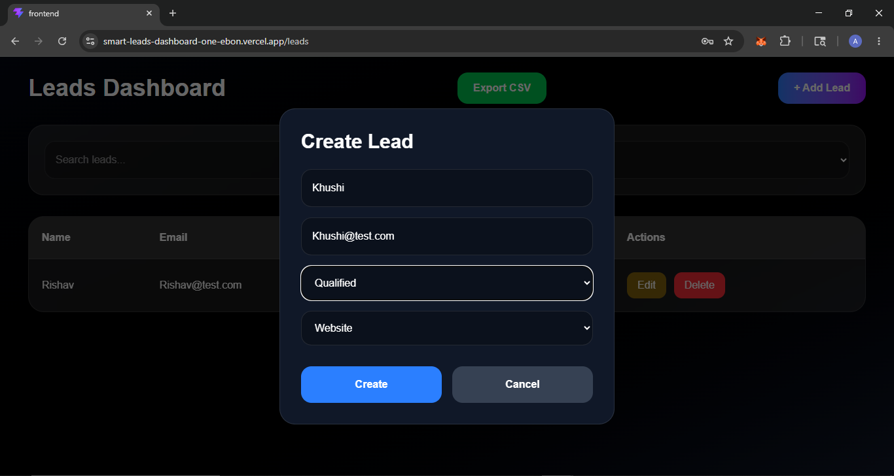

# Smart Leads Dashboard

A modern full-stack lead management dashboard built using the MERN stack with TypeScript.
The project supports authentication, role-based access control, lead management, CSV export, Docker support, and deployment-ready architecture.

---

# Features

## Authentication & Security

* JWT Authentication
* Password hashing using bcrypt
* Protected API routes
* Persistent login using localStorage

## Role-Based Access Control

### Admin

* View leads
* Create leads
* Update leads
* Delete leads

### Sales User

* View leads
* Create leads
* Update leads
* Cannot delete leads

---

# Lead Management Features

* Create leads
* Update leads
* Delete leads
* Search leads
* Filter by status
* Pagination support
* CSV export

---

# UI Features

* Modern dark mode UI
* Responsive design
* Gradient dashboard cards
* Modal-based lead creation
* Debounced search
* Clean dashboard layout

---

# Tech Stack

## Frontend

* React
* TypeScript
* Vite
* Tailwind CSS
* Axios
* Zustand

## Backend

* Node.js
* Express.js
* MongoDB Atlas
* Mongoose
* JWT
* bcrypt

---

# Project Structure

```bash
smart-leads-dashboard/
│
├── backend/
│   ├── src/
│   ├── Dockerfile
│   └── .env
│
├── frontend/
│   ├── src/
│   ├── Dockerfile
│   └── vite.config.ts
│
└── docker-compose.yml
```

---

# Environment Variables

## Backend `.env`

```env
PORT=5000
MONGO_URI=your_mongodb_connection_string
JWT_SECRET=your_secret_key
```

---

# Local Installation

## Clone Repository

```bash
git clone https://github.com/devAmulya/smart-leads-dashboard.git
cd smart-leads-dashboard
```

---

# Backend Setup

```bash
cd backend
npm install
npm run dev
```

Backend runs on:

```bash
http://localhost:5000
```

---

# Frontend Setup

```bash
cd frontend
npm install
npm run dev
```

Frontend runs on:

```bash
http://localhost:5173
```

---

# Docker Setup

Run the complete application using Docker:

```bash
docker compose up --build
```

---

# Deployment

## Live Frontend Demo

https://smart-leads-dashboard-one-ebon.vercel.app

## Backend API

https://smart-leads-dashboard-ly7f.onrender.com/

## Deployment Platforms

* Frontend deployed using Vercel
* Backend deployed using Render
* Database hosted on MongoDB Atlas


---

# API Endpoints

## Authentication

| Method | Endpoint             | Description      |
| ------ | -------------------- | ---------------- |
| POST   | `/api/auth/register` | Register user    |
| POST   | `/api/auth/login`    | Login user       |
| GET    | `/api/auth/me`       | Get current user |

---

## Leads

| Method | Endpoint                | Description   |
| ------ | ----------------------- | ------------- |
| GET    | `/api/leads`            | Get all leads |
| POST   | `/api/leads`            | Create lead   |
| PUT    | `/api/leads/:id`        | Update lead   |
| DELETE | `/api/leads/:id`        | Delete lead   |
| GET    | `/api/leads/export/csv` | Export CSV    |

---

# Demo Credentials

## Admin Account

```txt
Email: admin@test.com
Password: adminpassword123
```

## Sales Account

```txt
Email: sales@test.com
Password: salespassword123
```

---

# Screenshots

## Login Page



## Dashboard



## Create Lead Modal



---

# Future Improvements

* Analytics charts
* Toast notifications
* Real dashboard statistics
* Email integrations
* Activity logs
* Advanced filtering

---

# Author

Amulya Gupta
